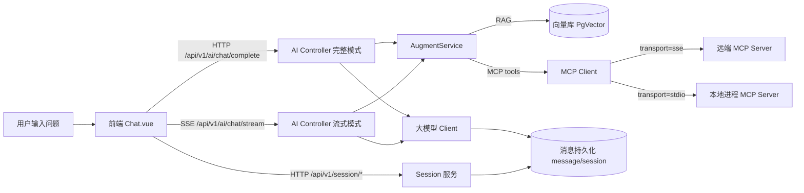
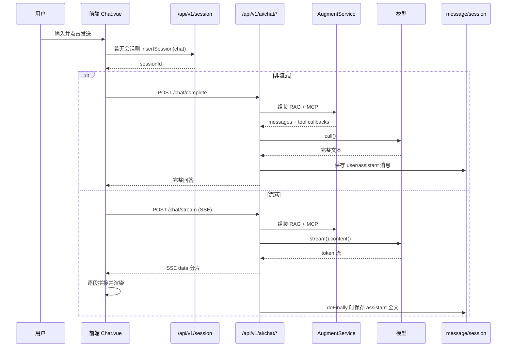

# 从 0 到 1 搞懂 AI 聊天项目：Session、SSE、STDIO、流式传输（结合本项目实战）

> 目标：你不需要预先懂 AI，也能把一个聊天系统的核心链路“组块化”。
> 本文以你当前项目为例，带你把概念和代码一一对上。

---

## 1. 先建立一张总图（最重要）



你可以把它理解成 4 层：
1. **界面层**（Chat.vue）
2. **会话层**（session）
3. **推理层**（chat complete/stream）
4. **增强层**（RAG + MCP）

---

## 2. 核心概念，用“人话”先记住

## 2.1 Session（会话）

- 就是“这次聊天是谁、在哪个对话线程里”的唯一标识。
- 没有 session，就像你每发一句话都在新窗口，模型记不住上下文。
- 本项目里会话有类型：`chat/work`，后端会校验类型匹配。

代码锚点：
- 前端创建会话：`frontend/src/components/Chat.vue:281`
- 会话 API：`backend/ai-agent-trigger/src/main/java/com/dasi/trigger/http/SessionController.java:16`
- 后端 chat 接口校验会话：`backend/ai-agent-trigger/src/main/java/com/dasi/trigger/http/AiController.java:149`

---

## 2.2 流式传输（Streaming）

- 非流式：模型想完一次性返回（你会感觉“等很久后一下出来”）。
- 流式：模型边想边吐 token（你会看到文字逐步出现）。

本项目两条接口：
- 非流式：`/api/v1/ai/chat/complete`
- 流式：`/api/v1/ai/chat/stream`

代码锚点：
- 前端调用：`frontend/src/request/api.js:44`, `frontend/src/request/api.js:71`
- 后端实现：`backend/ai-agent-trigger/src/main/java/com/dasi/trigger/http/AiController.java:136`, `backend/ai-agent-trigger/src/main/java/com/dasi/trigger/http/AiController.java:211`

---

## 2.3 SSE（Server-Sent Events）

- 一种**服务端单向推送**到前端的 HTTP 流协议。
- 前端连接后，服务端持续发 `data: ...` 事件块。
- 很适合“AI逐字输出”这类单向场景。

本项目前端的解析器：
- `streamFetch` 用 `fetch + ReadableStream` 持续读流。
- 按 `\n\n` 切事件块，再提取 `data:` 行。

代码锚点：
- `frontend/src/request/request.js:118`
- `frontend/src/request/request.js:194`

---

## 2.4 STDIO（标准输入输出）

- 不是给浏览器的，是**后端进程与本地工具进程通信**的一种方式。
- 你可以理解为：后端启动一个命令行程序，然后通过 stdin 写请求、stdout 读响应。
- 在 MCP 里，这是一种 transport（另一种是 SSE）。

本项目里 MCP transport 两种：
- `sse`
- `stdio`

代码锚点：
- 枚举：`backend/ai-agent-domain/src/main/java/com/dasi/domain/ai/model/enumeration/AiMcpType.java:10`
- 具体构造：`backend/ai-agent-domain/src/main/java/com/dasi/domain/ai/service/augment/AugmentService.java:108`

---

## 3. 你当前 Chat.vue 的生命周期在做什么

你问到的 `onMounted`，本质上是“聊天页启动引导器”。

```js
onMounted(() => {
  scrollToBottom(false);
  attachListeners();
  Promise.all([fetchTags(), fetchModels(), fetchMcpTools()]).then(async () => {
    if (chatStore.currentChat) {
      await ensureChatSessionValid(chatStore.currentChat);
    }
    await consumeWelcomeLaunchTask();
  });
  autoRefreshTimer = window.setInterval(async () => {
    if (sending.value || messageLoading.value) return;
    const session = chatStore.currentChat;
    const sessionId = session?.sessionId || ;
    if (!sessionId) return;
    await loadChatMessages(sessionId, session?.id);
  }, 5000);
});
```

### 拆成 5 步

1. 初始化视图状态（滚动到底）
2. 绑定监听器（滚动、键盘等）
3. 并发拉基础数据：RAG 标签、模型列表、MCP 工具
4. 校验当前会话还有效，再尝试消费 welcome 的“一次性启动任务”
5. 启动轮询：每 5 秒拉一次消息（空闲时）

### 关于 `Promise.all`

是的，语义是“全部 fulfilled 才进 then”。

但这里三个函数内部都自己 `try/catch` 了，通常不会向外 reject，所以 `then` 基本都会执行，只是某些列表可能为空。

代码锚点：
- `fetchTags`: `frontend/src/components/Chat.vue:378`
- `fetchModels`: `frontend/src/components/Chat.vue:404`
- `fetchMcpTools`: `frontend/src/components/Chat.vue:448`

---

## 4. 一次“发送消息”到底经过哪些环节



---

## 5. 前端状态是怎么组织的（Pinia 组块）

`useChatStore` 负责“聊天 UI 状态机”：
- `chats`：会话列表
- `currentChatId`：当前会话
- `sending`：是否正在请求
- `abortController`：终止正在进行的流

常用动作：
- `setChats/setCurrentChatId/upsertChat`
- `addUserMessage/addAssistantMessage/updateAssistantMessage`
- `stopCurrentRequest`（中止流）

代码锚点：
- `frontend/src/router/pinia.js:235`

你可以把它看成“前端小型会话内存数据库”。

---

## 6. RAG、MCP、模型 三者是什么关系

很多新人会混：

- **模型（LLM）**：负责推理和生成文本（核心大脑）
- **RAG**：给模型补“外部知识片段”（先检索，再注入上下文）
- **MCP**：给模型补“外部工具能力”（查天气、发企业微信、发邮件等）

在本项目里，`AugmentService` 同时做这两件增强：
1. `augmentRagMessage`：把向量检索结果塞进系统提示词
2. `augmentMcpTool`：按 mcpIdList 构造可调用工具

代码锚点：
- `backend/ai-agent-domain/src/main/java/com/dasi/domain/ai/service/augment/AugmentService.java:57`
- `backend/ai-agent-domain/src/main/java/com/dasi/domain/ai/service/augment/AugmentService.java:91`

---

## 7. 为什么需要 session 校验

后端每次 chat 请求都会做：
- 会话存在吗
- 类型匹配吗（chat/work）
- 用户有权限访问吗

这可以避免：
- 跨用户窜会话
- 用 work 会话调用 chat 接口
- 已删除会话继续写入

代码锚点：
- `backend/ai-agent-trigger/src/main/java/com/dasi/trigger/http/AiController.java:149`
- `backend/ai-agent-trigger/src/main/java/com/dasi/trigger/http/AiController.java:224`

---

## 8. 你最值得先掌握的“最小实现模型”

如果你想自己实现一个最小聊天系统，顺序建议：

1. 先做 `session` 的 CRUD（至少 insert + list + message list）
2. 做非流式 `chat/complete`
3. 再升级流式 `chat/stream` + 前端增量渲染
4. 最后加 RAG（知识增强）和 MCP（工具增强）

先跑通“主干”，再加“增强”。

---

## 9. 学习时的组块记忆法（给零基础）

把整个系统记成一句话：

**“前端拿 session 发消息，后端把消息交给模型；如果开流式就用 SSE 一点点回传；需要外部知识用 RAG，需要外部动作用 MCP（SSE/STDIO）。”**

然后只背 4 个关键词：
- **Session**：上下文身份
- **Stream/SSE**：输出方式
- **RAG**：知识增强
- **MCP(含 STDIO/SSE)**：工具增强

---

## 10. 术语速查表（防混淆）

- **SessionId**：一次会话线程 ID
- **Token**：模型输出的最小片段（可理解为字/词碎片）
- **SSE**：服务端到前端单向推送流
- **STDIO**：进程间标准输入输出通信
- **RAG**：检索增强生成
- **MCP**：模型上下文协议（让模型调工具）

---

## 11. 结合你当前代码的一句话闭环

`Chat.vue` 在挂载时准备好模型/RAG/MCP与会话，`sendMessage` 统一管理发送流程，最后通过 `/chat/complete` 或 `/chat/stream` 到后端；后端在 `AiController` 做会话校验 + RAG/MCP增强 + 模型调用，并把消息落库，实现“可持续对话 + 可追溯历史 + 可流式体验”。

