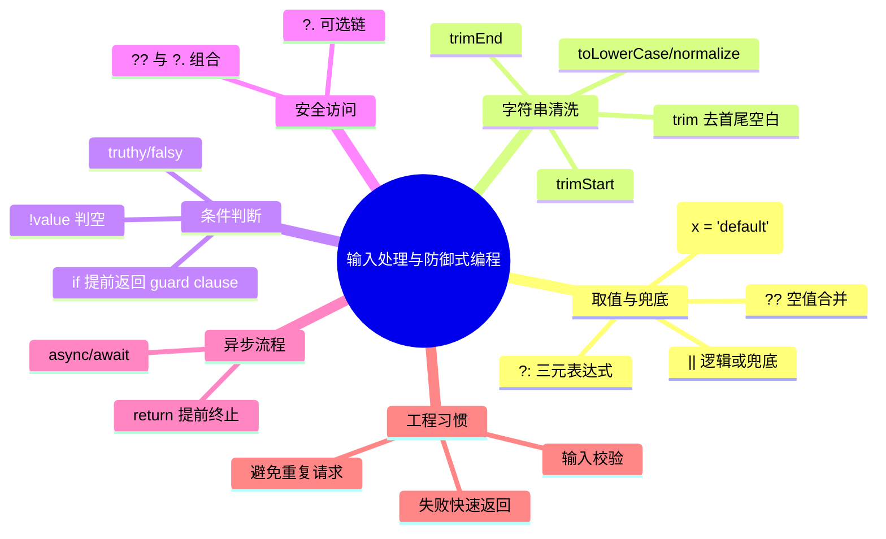

# 从 `??` 和 `.trim()` 出发：把 JavaScript 零散知识串成体系

> 适合对象：已经能看懂一点 JS 代码，但对语法点只会“见过”，还没形成整体认知的同学。

## 1. 你看到的那几行代码在做什么？

先看这段：

```js
const content = (options.content ?? inputValue.value).trim();
const requestedClientId = (options.clientId || '').trim();
const resolvedClientId = requestedClientId || currentModel.value;
if (!content || sending.value || !resolvedClientId) return;
```

它本质上是在做 4 件事：

1. **拿到内容**：优先用 `options.content`，没有再用输入框 `inputValue.value`。
2. **清洗字符串**：用 `.trim()` 去掉首尾空格。
3. **兜底选择**：`clientId` 没传就用当前模型 `currentModel.value`。
4. **提前返回**：如果内容空、正在发送、模型为空，就 `return`，不继续发送。

---

## 2. 锚点 1：`??`（空值合并运算符）

### 2.1 定义
`a ?? b` 的意思是：
- 如果 `a` 是 `null` 或 `undefined`，结果是 `b`
- 否则结果就是 `a`

### 2.2 和 `||` 的关键区别
`||` 会把“假值”都当成要兜底：`''`、`0`、`false`、`NaN`、`null`、`undefined`。

而 `??` 只关心“空值”：`null`、`undefined`。

例子：

```js
'' || 'A'    // 'A'
'' ?? 'A'    // ''

0 || 10      // 10
0 ?? 10      // 0
```

### 2.3 什么时候优先用 `??`
当你想表达“**只在值不存在时兜底**”，而不是“值为假时兜底”，优先选 `??`。

在你的代码里：

```js
options.content ?? inputValue.value
```

表示：如果调用方明确传了空字符串 `''`，也算“传了”，不会强制回退到输入框值。

---

## 3. 锚点 2：`.trim()`（字符串清洗）

### 3.1 定义
`str.trim()` 会移除字符串**首尾**空白字符（空格、换行、制表符等），中间内容不变。

```js
'  hello  '.trim()   // 'hello'
' a  b '.trim()      // 'a  b'
```

### 3.2 为什么常和表单输入一起出现
用户输入里常有无意义空格：
- 只输入空格，看上去像“有内容”，实际应算空
- 复制粘贴时前后可能带空格

所以典型写法是：

```js
const text = inputValue.trim();
if (!text) return; // 阻止“空消息”发送
```

### 3.3 注意事项
`.trim()` 只能给字符串调用。
如果值可能不是字符串，先做转换或判空：

```js
const safe = (value ?? '').toString().trim();
```

---

## 4. 扩散知识：这段代码背后的语法族谱

你现在看到的并不是几个孤立点，而是一个“小语法网络”。

### 4.1 关系图（知识地图）



---

## 5. 把你的代码逐行“翻译成人话”

```js
const content = (options.content ?? inputValue.value).trim();
```
- 用“传入内容”或“输入框内容”生成最终消息，再去掉首尾空格。

```js
const requestedClientId = (options.clientId || '').trim();
```
- 取外部传入的 `clientId`，如果没有就当空字符串，然后清理空格。

```js
const resolvedClientId = requestedClientId || currentModel.value;
```
- 如果外部传了合法 `clientId` 就优先用，否则用当前选中的模型。

```js
if (!content || sending.value || !resolvedClientId) return;
```
- 只要“消息空”或“正在发送”或“没有模型”，就立即退出，不发请求。

---

## 6. 学这块知识的前提（先修路线）

你现在最需要的前提，不是“背更多 API”，而是这 5 个基础：

1. **变量与数据类型**：`string / number / boolean / null / undefined`
2. **表达式与运算符**：`||`、`&&`、`!`、`??`、`?:`
3. **函数基础**：参数、返回值、默认参数
4. **流程控制**：`if`、`return`、提前返回（guard clause）
5. **异步基础**：`Promise`、`async/await`

如果这 5 个点打牢，你会发现 Vue/React 里的业务代码基本都能看懂 70% 以上。

---

## 7. 推荐学习顺序（最短路径）

### 阶段 A：先把“值”搞清楚
- 什么是 truthy/falsy
- `null` 和 `undefined` 的区别
- `||` 与 `??` 的区别

### 阶段 B：再学“输入清洗”
- `.trim()` / `.toLowerCase()` / 正则基础
- 前端输入校验的常见写法

### 阶段 C：最后串到“业务动作”
- `if (...) return` 防御式编程
- `async/await` 的请求流程
- 错误处理与状态锁（比如 `sending.value`）

---

## 8. 一组你可以立刻练习的小题

1. 把 `const name = input || '匿名'` 改成只在空值时兜底的写法。
2. 写一个函数，接收任意值并返回“去空格后的字符串”。
3. 模拟发送函数：当内容空或正在发送时，直接 `return`。
4. 比较下面表达式输出：
   - `0 || 1`
   - `0 ?? 1`
   - `'' || 'x'`
   - `'' ?? 'x'`

---

## 9. 结语

你现在的“碎片化”非常正常。真正的突破点不是记语法，而是把语法放进“**输入 -> 清洗 -> 校验 -> 执行**”这个流程里理解。

以 `??` 和 `.trim()` 为锚点，你已经站在前端业务代码最常见的主干上了。接下来只要围绕这条主干反复练几次，知识会很快从碎片变成网络。
